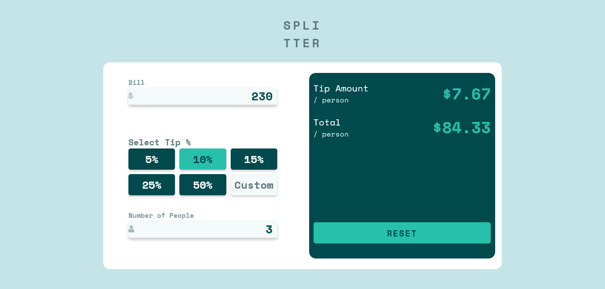

# Frontend Mentor - Tip calculator app solution

This is a solution to the [Tip calculator app challenge on Frontend Mentor](https://www.frontendmentor.io/challenges/tip-calculator-app-ugJNGbJUX). Frontend Mentor challenges help you improve your coding skills by building realistic projects.

## Table of contents

- [Frontend Mentor - Tip calculator app solution](#frontend-mentor---tip-calculator-app-solution)
  - [Table of contents](#table-of-contents)
  - [Overview](#overview)
    - [The challenge](#the-challenge)
    - [Screenshot](#screenshot)
    - [Links](#links)
  - [My process](#my-process)
    - [Built with](#built-with)
    - [What I learned](#what-i-learned)
  - [Author](#author)

## Overview

### The challenge

Users should be able to:

- View the optimal layout for the app depending on their device's screen size
- See hover states for all interactive elements on the page
- Calculate the correct tip and total cost of the bill per person

### Screenshot



### Links

- [Code Source](https://github.com/zougari47/tip-calculator)
- [Live Demo](https://zougari47.github.io/calculator-app-main/)

## My process

### Built with

- Semantic HTML5 markup
- SASS
- JavaScript

### What I learned

This was good challenge my JavaScript skills, I do a lot of work like :

- Force the user to enter just numbers and dot
- Prevent the use from entering multiple dot
- The button is always disabled until the use fill inputs and one of tips is chosen
- Custom input max number 100 and low is 0, and you can't type more than two numbers after dot.
- Even if the use type decimal number while counting we count just the integer number.

Snippet of the Math calculation

```js
 //   calculation
  const tip = (perCent * bill) / 100 / people;
  const total = bill / people + tip;

  // set the result
  tipPrice.textContent = `$${tip.toFixed(2)}`;
  totalPrice.textContent = `$${total.toFixed(2)}`;
}
```

## Author

- Frontend Mentor - [@zougari47](https://www.frontendmentor.io/profile/zougari47)
- Twitter - [@zougari47](https://www.twitter.com/zougari47)
- codepen - [@zougari47](https://codepen.io/zougari47)
